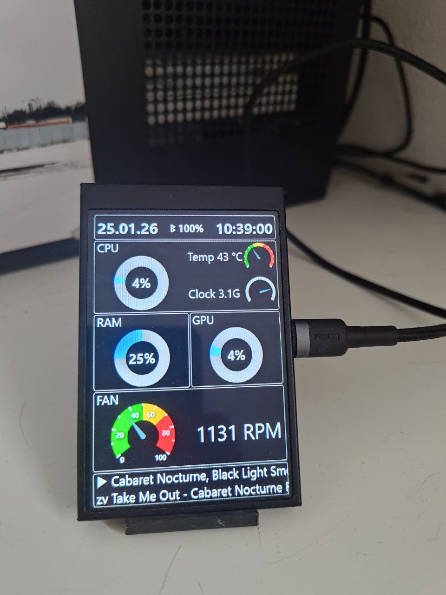
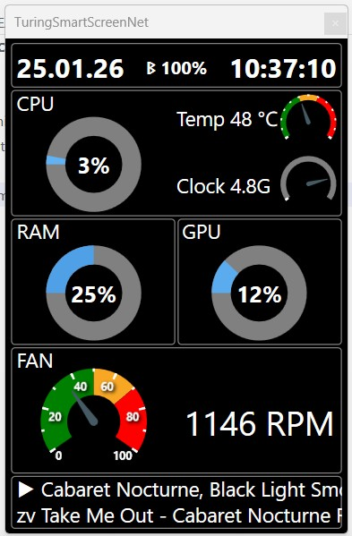

# Пет проект.
## Вывод на экран 320х480 пикселей информации о системе
* Загрузка процессора
* Температура процессора
* Частота процессора
* Общая загрузка GPU
* Использование ОЗУ
* Скорость вращения вентилятора на процессоре
* Дата, время
* Статус подключения нашуников и уровень заряда
* Вывод информации о проигрываемом трекре (только zvuk.com и vk.com) через расширение к Chrome

Используемое устройство - монитор на usb-com 3,5 дм, 320х480 пикселей, Turing Smart Screen 3.5" http://turzx.com/

Единственный используемый архитектурный патерн "И так сойдет: работает, да и ладно". Делал для себя, код маленький, все захардкожено, никакой большой поддержки или развития не предвидится. Так что мне не стыдно =).

Благодарности и источники информации:
* https://github.com/mathoudebine/turing-smart-screen-python
* https://github.com/LolitaIceMia/Turing3.5ServerMonitor
* https://github.com/LibreHardwareMonitor/LibreHardwareMonitor
* https://github.com/nikvoronin/Xm4Battery

**Лицензия** - код свободен, делайте что хотите.

Теги: .Net 10, WPF, Bluetooth, Hardware, turzx, screen, USB35INCHIPSV2, 35inchENG

# Pet Project
## Displaying system information on a 320×480 pixel screen

* CPU load
* CPU temperature
* CPU frequency
* Total GPU load
* RAM usage
* CPU fan speed
* Date and time
* Headphone connection status and battery level
* Display of currently playing track information (only zvuk.com and vk.com) via a Chrome extension

Hardware used — a 3.5" USB-COM monitor with a 320×480 resolution, Turing Smart Screen 3.5"
http://turzx.com/

The only architectural pattern used is “Good enough: it works, so whatever.”
Made for personal use: the code is small, everything is hardcoded, and no serious support or further development is planned. So I’m not ashamed of it 🙂

Acknowledgements and information sources:
* https://github.com/mathoudebine/turing-smart-screen-python
* https://github.com/LolitaIceMia/Turing3.5ServerMonitor
* https://github.com/LibreHardwareMonitor/LibreHardwareMonitor
* https://github.com/nikvoronin/Xm4Battery

tags: .Net 10, WPF, Bluetooth, Hardware, turzx, screen, USB35INCHIPSV2, 35inchENG

**License** — the code is free; do whatever you want with it.

